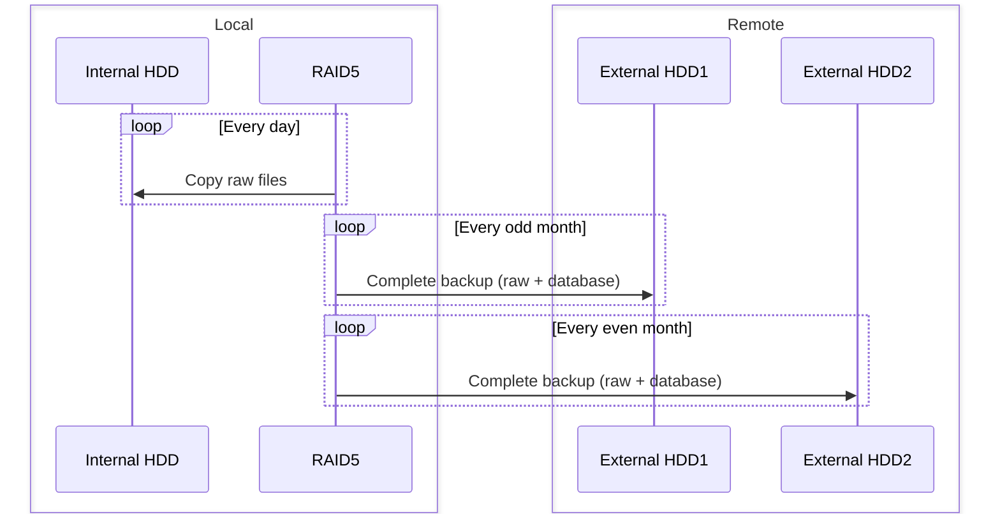
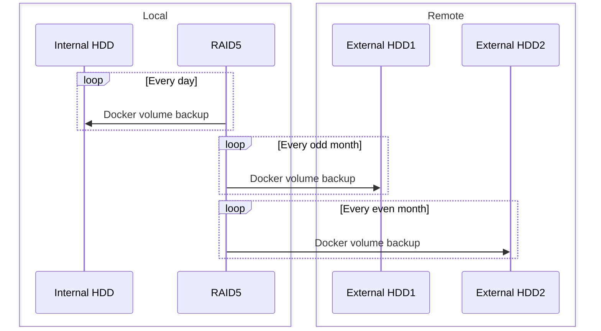

Storing and serving data is the main goal, but that data is precioussss and it would be awful to lose it.

<!-- more -->

# Backup methodology

In my homelab I will try to implement the well known 3-2-1-1-0-0 golden backup rule.

> 3 copies of the data (live copy, local backup and offsite backup)  
> 2 different media (Internal HHD, External HDD)  
> 1 copy offsite (External HDD)  
> 1 copy offline (External HDD)  
> 0 corrupted backup  
> 0 data loss

# Backup process

## Immich

## Vaultwarden

## Paperless

To be implemented

--8<--
docs/scripts/backup.md
--8<--