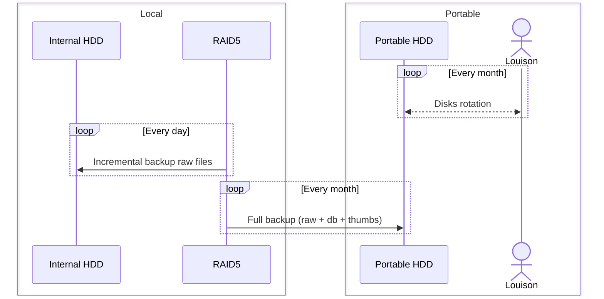
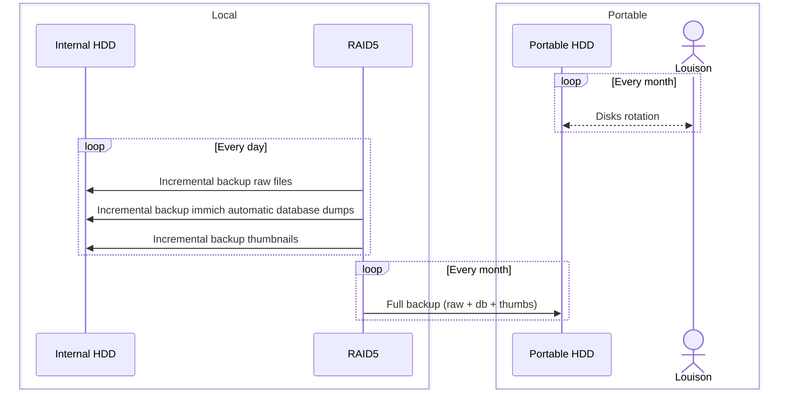

Storing and serving data is the main goal, but that data is precioussss and it would be awful to lose it.

<!-- more -->

# Backup methodology

In my homelab I will try to implement the well known 3-2-1-1-0-0 golden backup rule.

> 3 copies of the data (live copy, local backup and offsite backup)  
> 2 different media (Internal HHD, Portable HDD)  
> 1 copy offsite (Portable HDD)  
> 1 copy offline (Portable HDD)  
> 0 corrupted backup  
> 0 data loss

# Backup process

The basic approach is the following :

This strategy must be adapted to the target applications and taking into account the differents repositories and specific features.

## Immich

## Papra

# Hardware setup

## Portable HDD setup

To achieve my goal I choose the following disks : WD Elements - 2To - USB 3.0 (WDBU6Y0020BBK-WESN).  
I estimate the storage need to :

- Documents : 10 Go (+10Mo/year)
- Pictures : 200 Go (+200Mo/year)
- Miscllaneaous (Vaultwarden, etc.) : 10 Go

Totalling 220 Go on year 0 and up to 1 Go every 5 years, making 2 To more than sufficient !

Once bought, I had wipe the NTFS partition and setup a ext4 partition.  

# Backup tool

There is plenty of backup tools out there !

# Storage inventory

~~Gotify :                    gotify_data:/app/data                       => RAID~~
~~Immich_machine_learning :   immich_model_cache:/cache                   => RAID~~
~~Immich_database :           immich_database:/var/lib/postgresql/data    => RAID~~
~~Radarr :                    radarr_data:/config                         => RAID~~
~~Sonarr :                    sonarr_data:/config                         => RAID~~
~~Transmission :              transmission_data:/config                   => RAID~~
~~Jackett :                   jackett_data:/config                        => RAID~~
~~Jellyseerr :                jellyseerr_data:/app/config                 => RAID~~
~~Grafana :                   grafana_data:/var/lib/grafana               => RAID~~
~~Authelia :                  authelia_data:/config                       => RAID~~
~~LLDAP :                     lldap_data:/data                            => RAID~~
~~Traefik :                   traefik_certs_data:/var/traefik/certs/:rw   => RAID~~
~~Vaultwarden :               vaultwarden_data:/data                      => RAID~~
~~Jellyfin :                  media_jellyfin_config:/config               => RAID

