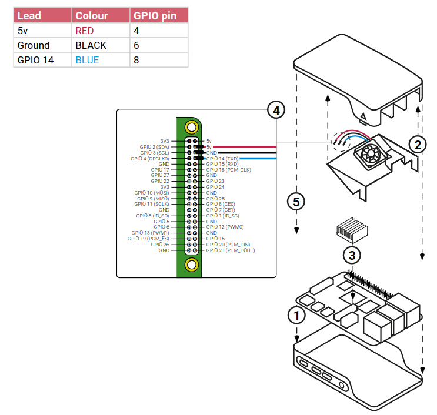

# Description

This script is dedicated to control a PWM fan on my Raspberry PI 4B 8 Go. To use correctly this script, please install the fan following the information bellow :

!!! warning "Be sure to plug the cable accordingly !"

    

# Script overview

```python title="pwm_fan_control.py"
--8<--
scripts/pwm_fan_control/pwm_fan_control.py
--8<--
```
# Setup

1. Ensuring the GPIO lib is isntalled : `pip freeze | grep RPi.GPIO`
2. Creating a systemd service file : `sudo nano /etc/systemd/system/pwm_fan_control.service`
3. Add :
```ini title="pwm_fan_control.service"
--8<--
scripts/pwm_fan_control/pwm_fan_control.service
--8<--
```
4. Reloading systemctl : `sudo systemctl daemon-reload `
5. Enabling our service : `sudo systemctl enable pwm_fan_control.service`
6. Starting our service : `sudo systemctl start pwm_fan_control.service`
7. Checking our service : `sudo systemctl status pwm_fan_control.service`

!!! tip "How to test the script"
      - Stress the CPU to increase the temp : `fulload() { dd if=/dev/zero of=/dev/null | dd if=/dev/zero of=/dev/null | dd if=/dev/zero of=/dev/null  | dd if=/dev/zero of=/dev/null & }; fulload; read; killall dd`  
      The more `| dd if=/dev/zero of=/dev/null ` the higher it will reach
      - You can check the temp with `vcgencmd measure_temp|sed 's/[^0-9.]//g'`